# Merise (MCD, MLD et MPD)

## Introduction
*_Merise_* est le nom d'une méthode, ou d'un ensemble de méthodes, développée en France dans les années 1970, et qui a été très largement employée depuis lors. Depuis une quinzaine d'années, Merise laisse peu à peu place à UML.

Toute base de données va donner lieu à une double représentation :

1. le plan le plus abstrait (mais qui contient déjà toutes les informations indispensables pour la construction de la base de données) . Ce plan porte le nom de fort poétique de **Modèle Conceptuel de Données (MCD)**.
2. un plan plus proche de ce que sera la base effective, telle qu'elle sera réalisée sur machine : le **Modèle Logique des Données (MLD)**.

Le point crucial à enregistrer dès maintenant, c'est que *le MLD se déduit strictement du MCD d'après des règles formelles*. Autrement dit, une fois le MCD réalisé, il n'y a plus besoin de réfléchir une seule seconde pour produire le MLD : tout se fait par automatismes. La meilleure preuve, c'est qu'il existe des logiciels qui se proposent de réaliser le MLD d'un clic de souris, d'après le MCD. En revanche, il n'existe rien de tel pour concevoir le MCD : le seul ingrédient qui entre dans sa composition est l'huile de neurones. N'oubliez pas de faire quelques provisions...

## MCD, Les entités et les relations

Les informations à traiter doivent être regroupées en ensembles cohérents, comme dans les tableaux que nous avons constitués il y a un instant. Dans les conventions de Merise, ces ensembles s'appellent des **entités**, et sont symbolisés par des **rectangles**. Chaque entité porte un **nom**, qui l'identifie de manière unique. Ce nom sera obligatoirement un *_substantif au pluriel_* : pour notre discothèque, on propose très logiquement « Disques » et « Genres ».

Les entités comprennent toujours un certain nombre d'éléments appelés **propriétés** (on parlera aussi d'**attributs**). Il s'agit des différentes rubriques qui devront être renseignées pour chaque individu.

Chaque entité, lorsqu'on passera au MLD (puis à la réalisation concrète de la base) donnera lieu à un tableau (on parle plus volontiers de **tables**). L'entité Disques du MCD produira donc une table Disques dans le MLD, et l'entité Genres, une table Genre. Les différentes propriétés de l'entité, qui sont donc écrites les unes sous les autres, deviendront *_les titres des colonnes_* de ces tables. Et dans ces colonnes, on fera figurer les différentes valeurs que prennent ces propriétés pour chacun des éléments de nos tables. Si vous trouvez cette explication un peu compliquée, pensez tout simplement à l'entité / table Disques : le titre, l'année et l'artiste sont disposés les uns sous les autres lorsqu'on parle de l'entité, et les uns à côté des autres (ce sont des en-têtes de colonne) lorsqu'on la représente comme une table.

Il ne reste plus à signifier que pour que chaque CD possède un genre (et pas n'importe lequel), mes deux entités doivent se trouver en **relation** l'une avec l'autre. Cette relation (on peut aussi parler d'**association**) sera symbolisée par un **ovale**, et sera nommée (par un *_verbe_*).

Voilà donc ce que cela donne :
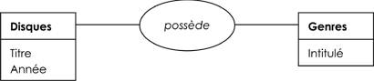

Cette représentation ne se lit pas n'importe comment. Pour être certain de ne pas commettre de contresens, lorsqu'on traduit le schéma ci-dessus, il vaut mieux éviter de dire « les disques possèdent des genres », ou pire encore « la table disque possède certains genres » La bonne traduction, celle qui vous évitera au maximum de commettre des erreurs, consiste à dire que « __Chaque élément de la table Disques possède un (ou plusieurs ?) genres__ ». En prenant l'affaire par l'autre bout, on peut tout aussi bien dire (même si c'est un peu laid à l'oreille) : « Chaque genre est possédé par un (ou plusieurs ?) disques » (on verra un peu plus loin comment en avoir le cœur net sur ces points d'interrogation).

Résumons-nous :

+ les données doivent être systématiquement regroupées de manière à éviter les **redondances**, source de gâchis et, surtout, d'erreurs. Ce regroupement est la base de la modélisation.
+ chacun des groupements (correspond, dans le MCD, à une **entité**, qui se traduira par une table dans la Base de Données.
+ toute **entité** est symbolisée par un **rectangle**. Elle est nommée par un substantif au pluriel, désignant les éléments qu'elle contient
+ les **propriétés** d'une **entité** correspondent aux colonnes de la table qui sera déduite de cette entité.
+ les entités (c'est-à-dire : les individus présents dans les entités) peuvent être mises en rapport via des **relations** (ou **associations**)
+ toute **relation** est symbolisée par un **ovale**. Elle est nommée par un verbe.

## Éléments supplémentaires

### Deux nouveaux mots de vocabulaire

Dans une table, on évite de parler de « lignes » et de « colonnes ».

+ Les lignes correspondent aux différents individus, ou aux différents objets individuels, répertoriés dans une table : dans la table Disques, chaque ligne correspond à un de mes CD. Ces différents éléments individuels qui correspondent aux lignes sont appelés **enregistrements**.
+ Les colonnes, qui correspondent aux propriétés de l'entité dans le MCD, sont appelées des **champs**.

### Typage des propriétés

Vous ne serez guère étonnés d'appendre que les informations contenues dans les entités (donc, dans les tables) vont devoir au bout du compte être codées numériquement afin d'être stockées sur un support informatique, sous un nom qui est celui de la propriété.

Pour chaque enregistrement, celle-ci se comporte donc comme un **nom de variable**… ce qui est somme toute logique, car à de menus détails près, c'en est une. Tout ceci nous amène au fait que les propriétés, à l'instar des variables, relèvent de certains **types**.

Dans le détail, les types disponibles pour les propriétés varient légèrement d'un système de gestion de bases de données à l'autre. En ce qui nous concerne, nous pouvons en rester à un niveau assez général, en considérant les types les plus courants :

+ **numérique** : on y distingue systématiquement l'entier (« Integer ») du nombre à virgule (« Float »). Le type « AutoIncrement », souvent utilisé pour gérer les **clés primaires** [MODE NO PANIC ON] vous saurez ce que c'est très bientôt  [MODE NO PANIC OFF], correspond à un entier dont la valeur est automatiquement attribuée à la création d'un nouvel enregistrement. Les bases de données proposent également toujours au moins un type Date/Heure.
+ **texte** : on aura éventuellement différents types correspondant à différentes longueurs maximales du texte.
+ **booléen** : inévitable !

Outre les informations précédemment citées, les documents de modélisation, MCD et MLD, devront donc faire apparaître, pour chaque entité, le type de chaque propriété.

## Propriété identifiante (clé primaire)

Tout système de bases de données impose dans chaque entité, chaque individu (chaque enregistrement) puisse être identifié de manière unique, sans ambiguité, par la machine. Le procédé le plus courant consiste à dédier à cela une propriété spéciale, appelée **propriété identifiante** ou encore **clé primaire**. On peut constituer une clé primaire à partir d'une combinaison de champs, mais nous verrons que c'est une solution qui n'est employée que dans certains cas particuliers ; restons-en donc pour le moment à l'idée que la clé primaire est un champ spécial. La clé primaire est alors généralement placée en tête de la liste des propriétés, en la soulignant pour indiquer son statut particulier :

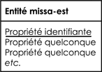

Il est en fait assez rare de trouver spontanément une propriété capable de jouer ce rôle. Même les propriétés qui semblent faire de bonnes candidates (par exemple, une plaque d'immatriculation ou un numéro de sécurité sociale) ne sont pas forcément aussi opportuns qu'elles en ont l'air, pour un certain nombre de raisons. Et il n'est pas rare qu'aucune des propriétés présentes ne puisse nous prémunir contre les doublons ; c'est le cas avec l'entité Disques de notre exemple : plusieurs Cd peuvent très bien avoir le même titre, et je ne parle pas de l'auteur ni de l'année. On ne peut pas davantage exclure la possibilité que deux auteurs homonymes aient sorti la même année un disque portant le même titre (ce qui nous empêche donc d'avoir confiance dans une clé primaire constituée de la combinaison des trois propriétés).

Voilà pourquoi le plus souvent, on sera amené à créer une __propriété supplémentaire__ destinée uniquement à jouer le rôle d'indentifiant / clé primaire. Il s'agira presque toujours d'un code, unique pour chaque occurrence de l'entité (et voilà pourquoi un nombre de type « autoincrement » est si pratique). Ce code sera rarement visible par l'utilisateur, qui ignorera sans doute son existence : il n'en sera pas moins indispensable pour le système informatique. Ainsi, notre modèle de discothèque deviendra-t-il :

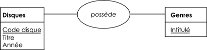

## Les cardinalités

Contrairement à ce que certains pourraient penser, ce terme n'indique ni le fait de devenir cardinal (Dieu m'en garde !) ni le fait de se situer à l'un des quatre points cardinaux (en l'occurrence, complètement à l'Ouest). Non, la cardinalité, c'est un mot savant de mathématicien pour dire tout bêtement que l'affaire a un rapport avec des nombres et des quantités. Pour dire la même chose, on aurait pu donc tout simplement parler de « quantité » ou de « numération ». Sauf que dans un dîner de famille, placez subrepticement « cardinalité » entre la poire et le fromage, et vous pourrez vérifier par vous-mêmes que l'effet obtenu n'est pas du tout le même.

### Encore et à nouveau la discothèque

Dans le MCD que l'on vient d'élaborer, il manque une information essentielle pour la suite : à combien d'éléments de l'autre entité chaque élément peut-il être associé ? Lorsqu'on bâtit une relation entre deux entités, on doit nécessairement préciser ce point, car de lui dépendent de très importantes conséquences.

Dans l'exemple que nous avons pris, celui de la discothèque, il paraît évident qu'un même genre musical peut être représenté par plusieurs disques. En sens inverse, en revanche, on peut être embêté pour décider à combien de genres peut correspondre chaque disque. On peut en effet imaginer soit que chaque disque ne puisse être rattaché qu'à un genre et un seul afin de faciliter le classement, soit qu'à chaque disque on puisse attribuer plusieurs genres à la fois, ce qui introduit davantage de complexité, mais aussi davantage de souplesse.

La décision, dans cette alternative, n'appartient pas à l'informaticien : il s'agit d'un choix d'ordre fonctionnel, qui doit être subordonné aux besoins de l'organisation pour laquelle est conçue de la base de données. Il n'existe donc aucune règle qui permette de trancher a priori entre les deux possibilités... excepté que la technique doit être au service des besoins de ceux qui s'en serviront, et non l'inverse. En revanche, ce qui nous intéresse ici, ce sont les conséquences de ce choix sur notre base de données.

### Cardinalités minimum et maximum

Un modèle (conceptuel), lorsqu'il met en relation deux entités A et B, doit toujours stipuler à combien d'éléments de l'entité B chaque élément de A peut correspondre, et inversement – c'est ce qu'on appelle la définition des **cardinalités**. De là, il faut distinguer le nombre **minimum** et le nombre **maximum** de ces correspondances : pour chaque élément d'une entité, on doit donc stipuler à combien d'éléments de l'autre entité celui-ci est susceptible de correspondre, au minimum et au maximum. Ainsi, toute relation entre deux entités impose de préciser quatre nombres (quatre cardinalités) : cardinalité minimum de A vers B, maximum de A vers B, minimum de B vers A, maximum de B vers A.

En reprenant l'exemple de la dicothèque, cela revient à se poser les questions suivantes :

+ À combien de genres au minimum correspond chaque CD ? (autrement dit : un CD peut-il ne pas avoir de genre, ou en a-t-il forcément au moins un ?)
+ À combien de genres au maximum correspond chaque CD ? (autrement dit : un CD peut-il avoir plusieurs genres, ou est-il limité à un seul ?)
+ À combien de CD au minimum correspond chaque genre ? (autrement dit : ma table des genres comprend-elle uniquement des genres qui correspondent à mes CD, ou peut-il y avoir des genres « orphelins » ?)
+ À combien de CD au maximum correspond chaque genre ? (autrement dit : puis-je avoir plusieurs CD du même genre, ou est-ce interdit ?)

### Les valeurs possibles

Les cardinalités obéissent à un formalisme assez étroit :

+ La cardinalité minimum ne peut prendre que les valeurs 0 ou 1. Autrement dit, soit on considère qu'un élément de la table A peut être en relation avec un (ou plusieurs) éléments de la table B (mais que ce n'est pas obligatoire), soit on considère que tout élément de la table A doit impérativement être en relation avec au moins un élément de la table B. Dans notre exemple, choisir 1 comme cardinalité minimum signifie qu'un disque doit etre classé dans au moins un genre. Choisir 0 signifie qu'on estime que certains disques n'ont pas forcément de genre (le même problème se pose dans l'autre sens de la relation, pour savoir s'il peut exister ou non des genres sans disques).
+ La cardinalité maximum ne peut valoir que 1 ou N, autrement dit un ou plusieurs. C'est la discussion de tout à l'heure à propos des genres : autorise-t-on ou non chaque CD à être classé dans plusieurs genres à la fois ? En sens inverse, il ne fait aucun doute qu'à chaque genre, doivent pouvoir correspondre plusieurs CD.

Il n'existe donc que quatre cas de figure possibles pour les cardinalités : (0, 1), (0, N), (1, 1) et (1, N).

### Représentation
Dernier point, les cardinalités minimum et maximum sont représentées sous la forme d'un couple de nombres placé entre l'entité et la relation. Par exemple, dans le cas de notre discothèque, si on limite à un seul le nombre de genres autorisés par disque et qu'on conserve des genres sans disques correspondants, on a :

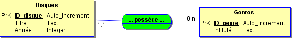

### Raccourcis de langage
Pour décrire les cardinalités, on va souvent user d'un raccourci de langage. Comme les cardinalités les plus décisives sur l'architecture de la base sont souvent les cardinalités maxima, on aura tendance à ne parler que d'elles. Ainsi, dans le cas d'une relation où l'une des deux cardinalités maximales vaut 1 et l'autre N, on dira volontiers qu'on a affaire à une relation **« un à plusieurs »**. Lorsque les deux cardinalités maximales valent N, on parlera de relation **« plusieurs à plusieurs »**.

Une relation de type « un à un » (où, donc, les deux cardinalités maximum sont égales à 1) est un cas limite. Cela signifie que nous avons créé deux entités qui en réalité n'en forment qu'une seule, puisque chaque élément de l'une corespond à un élément de l'autre, et à un seul. Ce n'est pas à proprement parler une faute, mais face à une telle situation, on a toujours intérêt à se demander ce qui justifie d'avoir créé deux entités plutôt qu'une seule.

## Du MCD au MLD : première approche

Je rappelle que par rapport au MCD, le MLD est un plan moins abstrait et plus proche de la réalité, c'est-à-dire de la base de données telle qu'elle existera sur les machines. Je rappelle aussi que toute la difficulté de la modélisation réside dans l'élaboration du MCD. Une fois que celui est conçu, le MLD s'en déduit par l'application de quelques règles (on pourrait dire : d'un algorithme). Donc, le passage du MCD au MLD n'est qu'une question de rigueur, et plus du tout d'intelligence ou d'imagination (« surtout pas ! », pourrait-on même dire).

Une première règle, d'une simplicité biblique, est que __toute entité du MCD devient une table du MLD. L'identifiant de chaque entité devient la clé primaire de chaque table__.

Ensuite, selon les cardinalités maximales qui caractérisent la relation, les choses vont se passer très différemment.

### Si les deux cardinalités maximales sont N
...autrement dit, si la relation est de type « plusieurs à plusieurs ». Dans le MLD, la relation devient alors une __nouvelle table__, elle-même en relation avec les deux tables produites par les deux entités. Une telle table est dite **table de correspondance**, ou encore **table de liaison, table de jonction, table d'association**, etc. Elle ne contient pas à proprement parler des données : son rôle est d'organiser les rapports entre les éléments des tables qui, elles, les contiennent. Une table de jonction contiendra uniquement des propriétés correspondant aux clés primaires des deux entités, qu'elle associera deux à deux :

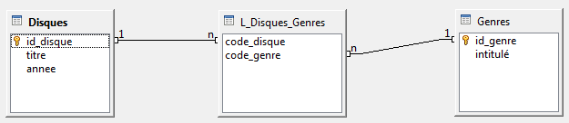

C'est très logique : la table de jonction va permettre d'associer tout élément de Disques à tout élément de Genres autant de fois que souhaité. Un même disque pourra ainsi être mis en rapport avec plusieurs genres, et un même genre avec plusieurs disques.

### Si l'une des deux cardinalités maximales vaut 1

Ce cas se divise à son tour en deux, selon la valeur de la cardinalité minimale concernée.

1. __On a une cardinalité (1, 1)__
Concrètement, cela veut dire, dans notre exemple, que chaque CD possède un genre et un seul. Un CD ne peut pas ne pas avoir de genre ; il ne peut pas non plus en avoir plusieurs. Dans ce cas, dans le MLD, cette relation devient une relation directe entre les deux tables. L'identifiant de la table côté « plusieurs » devient une nouvelle propriété de la table du côté « un », ainsi que l'illustre cet exemple :

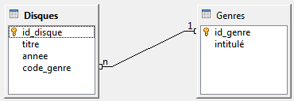

Quand on y réfléchit, c'est parfaitement logique : pour chaque disque, il faudra renseigner un code (et un seul) qui correspondra à l'un des genres présents dans la table Genres. La table Genre, elle, ne contient aucun code renvoyant vers les disques - sinon, cela voudrait dire que chaque Genre renvoie vers un disque et un seul ! En fait, on vient de retrouver par un long détour l'exemple à partrir duquel on avait introduit le raisonnement (« Tout ça pour ça », direz-vous...)

Et, au passage, pour cette nouvelle propriété dans la table Disques qui contiendra une valeur prise par la clé primaire de la table Genre, on dit qu'il s'agit d'une **clé étrangère**.

2. __On a une cardinalité (0, 1)__
Remarque essentielle : le raisonnement qui suit concerne en réalité toute situation dans laquelle la cardinalité minimale est égale à zéro. Cela correspond à la situation où chaque CD peut avoir un genre (au maximum) mais où il n'est pas obligé d'en avoir un. Là, les informaticiens se divisent en deux catégories. Il y a les coulants (les autres préfèreront les appeler les laxistes), qui diront : « Faisons au plus simple. Il suffit de créer une clé étrangère ; lorsque le disque n'aura pas de genre attribué, la valeur de la clé étrangère sera vide. Après tout, il n'y a pas de mal à cela. » Au passage, une valeur vide, dans une base de données, s'appelle en jargon une valeur Null. À cela, l'autre catégorie d'informaticiens, beaucoup plus nombreuse, que sont les rigoureux (et que les premiers appelleront les psycho-rigides) rétorquent : « Certes, on peut avoir des valeurs Null dans une table. Mais ce n'est jamais une bonne chose. On ne sait pas, par exemple, si c'est un défaut de saisie ou une valeur volontaire. Et puis, quand on fera des recherches ou des traitements automatisés, cela risque de nous jouer de bien vilains tours. Il est donc nettement préférable de jouer la sécurité : il suffit de créer une table de jointure, exactement comme dans le cas d'une relation « plusieurs à plusieurs ». Dans ce cas, plus de Null ; en revanche, il faudra mettre en place un contrôle pour être certain que chaque disque n'apparaît pas plus d'une fois dans la table d'association...

## Relations multiples

Il est tout à fait possible que deux entités soient reliées à la fois par plus d'une relation.

Une telle possibilité n'a rien d'absurde, et correspond à beaucoup de situations de la vie réelle.

Imaginons, par exemple, que nous ayons à modéliser les relations entre une population et un parc immobilier. Nous aurons deux entités : l'une qui identifiera les différents individus (et dont les propriétés seront leurs noms, prénoms, n° de sécurité sociale, etc.). L'autre entité recensera les différents logements (n° d'appartement, étage, adresse, etc.). Or, il est clair que la relation d'un individu avec un logement peut être de plusieurs natures différentes, qui sont très largement indépendantes les unes des autres :

* il peut en être propriétaire
* il peut en être locataire
* il peut en être bailleur
* il peut l'occuper à titre de résidence principale
* etc.

Face à ce problème, la solution est simple : les deux entités Individus et Logements doivent être reliées simultanément par plusieurs relations différentes. On parle alors d'associations plurielles. Cette technique illustre, en quelque sorte à l'envers, la question de la transitivité : il peut y avoir plusieurs relations qui mènent d'une entité à l'autre, à condition que ces relations possèdent des significations différentes.

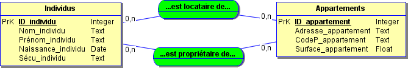

## La réflexivité

### Principe général

Encore un mot de matheux pour désigner une chose pas si compliquée qu'elle en a l'air, à savoir qu'une relation peut concerner des éléments d'une même entité.

Supposons une base d'individus, par exemple les animaux d'un zoo. En vue de suivre les pedigrees de chaque bébête, nous devons enregistrer qui est l'enfant de qui. Pour cela, il nous faudra relier l'entité Animaux à elle-même, par la relation « est le parent de… ». Cela peut paraître un peu bizarre, mais en réalité, cela ne pose aucun problème.

On pourra donc modéliser tout cela dans notre MCD de la manière suivante :

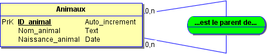

### Du MCD au MLD

Au niveau du MLD, il n'y a rien de particulier à signaler – les règles exposées plus haut s'appliquent. Si la relation réflexive est de type « un à plusieurs », avec une cardinalité minimale de 1, cette relation prendra la forme d'une propriété supplémentaire dans la table, destinée à contenir l'ID de l'élément concerné. Par exemple, la relation « est le père de », qui entre dans ce cas de figure (un père peut avoir plusieurs enfants, mais un enfant ne peut avoir qu'un seul père) se manifestera par un champ code_père, dans lequel on entrera, le cas échéant, l'ID du père :

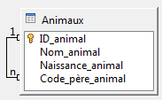

Si, en revanche, la relation réflexive est de type « plusieurs à plusieurs », elle donnera lieu à une nouvelle table. Celle-ci comportera deux champs, chacun des deux contenant l'ID d'un des deux animaux susceptibles de cohabiter. Et, toujours aussi logiquement, cette table de jointure sera reliée au champ ID_animal de la table Animaux par un double lien.

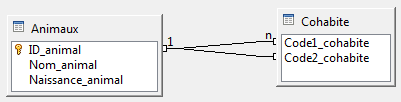

1. __NB 1 :__ On peut très bien imaginer une situation où une relation serait à la fois réflexive et plurielle ! En plus de savoir qui est le parent de qui, on pourrait ainsi noter qui peut être mis dans la même cage que qui (certains individus ne peuvent pas se blairer, et se battent dès qu'ils en ont l'occasion). Dans ce cas, pas de problème, l'entité Animaux sera greffée de deux relations réflexives différentes (« est le parent de » et « peut cohabiter avec »).

2. __NB 2 :__ Il serait en revanche tout à fait mal venu de créer deux relations, l'une « est le parent de » et l'autre « est l'enfant de ». Ce serait en quelque sorte un pléonasme, ces deux relations n'en faisant en réalité qu'une seule.

## Relations avec attributs

### Principe général

Prenons le cas tout bête d'une entreprise qui gère les commandes de ses clients.

Dans une première entité figurent les commandes, avec leur date, leur référence, etc. Pour savoir de quoi est composée chaque commande, on se tourne naturellement du côté d'une entité qui regroupe l'ensemble des produits vendus par notre entreprise. Au premier abord, il semble que nous soyons face à une situation déjà rencontrée maintes fois :

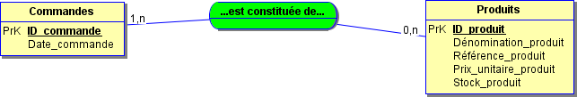

Sauf qu'il y a un petit souci : je n'ai fait figurer nulle part la quantité dans laquelle chaque produit entre dans chaque commande. Par exemple, la commande n°456 peut porter sur 45 rideaux de douche à fleurs roses et 12 gants de toilette en crin, la commande n°508 sur 23 gants de toilette en crin et 3 savons de Marseille, etc. Or ces nombres (45, 12 et 23) doivent obligatoirement être stockés quelque part, faute de quoi mon système de gestion de factures ressemblera à une passoire.

Première possibilité : je les intègre à la table des commandes. Hum... Comment faire ? En créant un seul attribut ? Mais cela veut dire que pour une commande donnée, on ne pourra renseigner qu'un seul nombre. Or, dans une commande, on peut commander plusieurs produits çà la fois (chacun dans une quantité différente). Donc, ça ne va pas.

Deuxième possibilité : j'intègre les quantités à la table des produits. Mais là, c'est le même problème : Si je crée un nouvel attribut (et un seul), cela veut dire qu'à chaque produit correspond une quantité et une seule. Sauf qu'évidemment, Il se peut très bien que le nombre de Kiki en peluche commandés par Bidule soit de 7 546 tandis que Machin, lui, en a acheté 12. Donc, problème.

Je n'ose même pas imaginer créer plusieurs attributs (quantité 1, quantité 2, quantité 3, etc.) : que ce soit dans une table ou dans un autre, ce serait un flagrant délit de propriété à valeurs multiples, dont on a vu précédemment qu'il s'agissait d'une faute irrémédiable.

Nous voilà donc bien avancés... En fait, toute la difficulté vient du fait que __le nombre de produits de chaque sorte qui ont été commandés est une caractéristique liée à chaque commande__. La solution s'impose d'elle-même : cette information doit donc figurer au cœur même de la relation qui unit les commandes aux produits. À chaque fois qu'une nouvelle commande porte sur un nouveau produit, on doit se demander : « en combien d'exemplaires ? ».

L'information (la propriété) « Quantité commandée » n'est donc pas un attribut d'une des deux entités Commandes et Produits, mais comme un **attribut** de la relation qui les unit.

Ce que nous représenterons de la manière suivante :

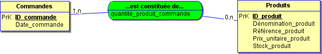

**Remarque vraiment intelligente** : une relation ne peut posséder légitimement un attribut que si elle est de type « plusieurs à plusieurs ». __Démonstration par l'absurde__:
imaginons qu'il ne puisse y avoir qu'un seul produit par commande. Dans ce cas, la quantité commandée serait unique pour chaque commande, et pourrait donc être un attribut de l'entité Commande.
inversement, si chaque produit ne pouvait être commandé qu'une fois et une seule, on pourrait ajouter la quantité comme attribut de l'entité Produits
Pour conclure, ajoutons que rien n'oblige une relation à posséder un seul attribut. Il est tout à fait possible qu'existent des relations avec deux, trois, quatre, etc. attributs.

### Passage au MLD

Aucune difficulté : une relation avec attributs étant nécessairement une relation « plusieurs à plusieurs », elle donnera naissance, lors du passage au MLD, à une nouvelle table (de jointure). Tout simplement, __les attributs de la relation deviendront des propriétés supplémentaires de la table de jointure__ (en plus des codes correspondant aux clés primaires des tables concernées).

## Relations de dimension supérieure à 2

### Principe général

Partons simplement du fait que jusqu'à présent, les relations que nous avons modélisées ne mettaient toujours aux prises que des entités deux à deux : les CD et les genres musicaux, les commandes et les produits, etc. Il peut cependant arriver que la relation doive s'établir directement entre plus de deux entités (d'où le titre).

Prenons un système d'information qui gère le travail quotidien dans une université (bon courage). Chaque jour, des groupes d'étudiants ont cours dans certaines salles avec certains professeurs. Mais on suppose que tout dans cette histoire est susceptible de varier : dans une journée donnée, le même groupe peut avoir cours avec plusieurs profs dans plusieurs salles différentes, les profs peuvent donner plusieurs cours ou aucun, etc.

La manière la plus directe de modéliser une telle situation sera d'écrire que :

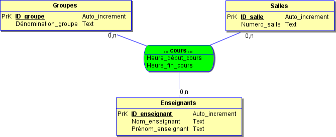

On est donc face à une relation impliquant non plus deux, mais trois entités, ce qui finalement, ne pose pas de problèmes particuliers. Au passage, on remarque qu'une relation de dimension supérieure à 2 peut fort bien comporter des atributs, comme toute autre relation (Ici, Heure_début_cours et Heure_fin_cours).

### Du MCD au MLD

On vérifie facilement qu'une relation de dimension supérieure à deux est forcément de type « plusieurs à plusieurs » (faudrait-il dire : « plusieurs à plusieurs à plusieurs » ? – en voilà une question qu'elle est bonne). Une telle relation devient donc systématiquement une table de jointure, comportant autant de champs que d'entités à relier.

## Exercice

Une bibliothèque de prêt dispose d'un certain nombre d'ouvrages, classés par rayon (Littérature, Histoire, Géographie, etc.). Chaque ouvrage est l'oeuvre d'un ou plusieurs auteurs, et doit également être référencé selon un certain nombre de mots-clés.

Chaque adhérent peut emprunter jusqu'à 5 livres en même temps, et dispose d'un certain délai passé lequel il doit recevoir des relances puis des pénalités.

On se place dans quatre cas successifs, de complexité croissante :

1. la bibliothèque ne possède qu'un seul exemplaire de chaque ouvrage. Elle enregistre uniquement les emprunts présents (il n'y a pas d'historique des emprunts passés).
2. la bibliothèque ne possède qu'un seul exemplaire de chaque ouvrage, mais elle tient un historique de tous les emprunts qui ont été effectués.
3. la bibliothèque tient un historique... et elle est maintenant susceptible de posséder plusieurs exemplaires de certains ouvrages
4. en plus de cela, il existe une bibliothèque centrale et des antennes locales. Chaque antenne possède un fonds qui lui est propre, et peut de surcroit se procurer certains ouvrages auprès de la bibliothèque centrale (mais pas d'une autre bibliothèque locale). Tout adhérent peut automatiquement emprunter des ouvrages dans toutes les antennes locales.

Etablir le MCD et le MLD adéquats dans les quatre cas.

## Correction:

[Correction day01 sur draw.io](https://drive.google.com/file/d/1TbUpz6fi9Nd0ydmfag0o3RKW11Joz6_f/view?usp=sharing)

