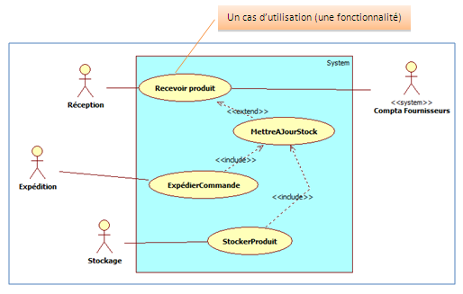
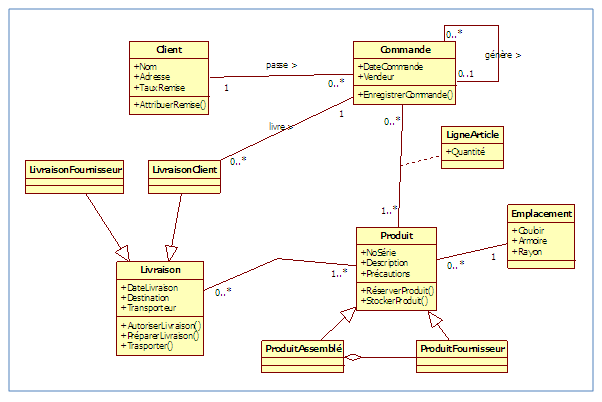
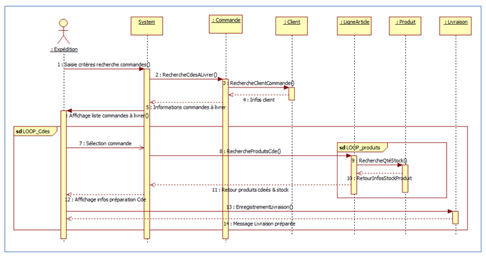

# UML (Diagramme de ['séquence', 'cas d'utilisation', 'classes'])

## Introduction
UML « Unified Modeling Language ». Est un langage visuel constitué d’un ensemble de schémas, appelés des diagrammes, qui donnent chacun une vision différente du projet à traiter. UML nous fournit donc des diagrammes pour représenter l'application à développer : son fonctionnement, sa mise en route, les actions susceptibles d’être effectuées par l'application, etc.

UML est une démarche qui se base sur une approche objet. Cette approche s’appuie sur 4 principes fondamentaux:
* itérative et incrémentale
* guidée par les besoins du client et des utilisateurs
* centrée sur l’architecture du logiciel
* qui décrit les actions et les informations dans une seule entité.

L’approche objet nécessite une démarche itérative et incrémentale, c’est-à-dire que le concepteur doit faire des allers-retours entre les diagrammes initiaux et, les besoins du client et des utilisateurs perçus au fur et à mesure de la conception du logiciel afin de le modifier si nécessaire. 

L’approche objet est guidée par les besoins du client. 

L’approche objet est centrée sur le diagramme de classes qui décrit aussi bien des actions que des informations dans une même entité. Les autres diagrammes nous aident à voir clair dans les besoins et dans la solution qui est à développer. Ils permettent de compléter le diagramme de classes.

## Les diagrammes UML:

La réalisation d’une application informatique est basée sur plusieurs diagrammes. Le langage UML est constitué de diagrammes., il existe 13 diagrammes, mais on va voir seulement les diagrammes suivants:

### Diagramme de cas d'utilisation

Le diagramme de cas d’utilisation représente les fonctionnalités (ou dit cas d’utilisation) nécessaires aux utilisateurs. On peut faire un diagramme de cas d’utilisation pour l'application entière ou pour chaque package.

lien EN: [Diagramme de cas d'utilisation UML](https://youtu.be/zid-MVo7M-E)

lien FR: [Diagramme de cas d'utilisation UM](https://youtu.be/J8NtoLxhoRc)

### Diagramme de classes

Dans la phase d’analyse, ce diagramme représente les entités (des informations) manipulées par les utilisateurs.
Dans la phase de conception, il représente la structure objet d’un développement orienté objet.

lien EN: [UML Class Diagram](https://youtu.be/UI6lqHOVHic)

### Diagramme de séquence

Le diagramme de séquence permet de décrire les différents scénarios d’utilisation du système.

lien EN: [Diagramme de Sequence UML](https://youtu.be/pCK6prSq8aw)

## Exercice

On s’intéresse à une société qui fabrique des composants de moteurs. Sur le plan des moyens de production, la société dispose de 6 usines dont une dédiée au montage.

La fabrication comporte une phase d’usinage, une phase de traitement thermique et de surface, puis de montage des sous-ensembles qui s’intégreront dans les moteurs.

La direction commerciale reçoit chaque jour les commandes clients. Compte-tenu des délais de fabrication (cycles de 8 à 15 mois), les clients pressés peuvent passer des commandes prioritaires mais au prix d’une surfacturation de 20 % de la commande.

Les usines les traitent alors en priorité. Les gros clients (plus de 10 commandes par an) sont traités en priorité aussi.

Après un contrôle technique des articles commandés, la direction commerciale introduit la commande en ordinateur et obtient en sortie, l’éclatement des ensembles composés en composants élémentaires qui appartiennent à deux catégories distinctes :

* Pièces fabriquées par l’entreprise
* Pièces sous-traitées

Elle imprime alors un listing de composants « maison » à destination des usines et un listing des composants sous-traités à destination du service de gestion du stock de l’entreprise pour approvisionnement. Ce service gère aussi l’approvisionnement bimensuel en matières premières. La commande globale est, elle, transmise à l’usine de montage qui ne peut finaliser la commande qu’après réception de l’ensemble des composants requis.

Des modifications (avenants) aux commandes clients peuvent être apportées après l’enregistrement de la commande, afin d’amender :

* les codes articles (dans le cas d’une évolution technique de l’article),
* ou les autres caractéristiques de l’article (délai, quantité commandée,…).

La direction commerciale se charge aussi du suivi de la facturation. Les coûts réels sont comptabilisés par commande reçue, avec une gestion du nombre d’heures passées (heures productives transmises par les usines) et de la valeur (prix d’achat) des matières premières ou pièces semi-finies en provenance de fournisseurs divers (fournie par le service de gestion du stock). La facture est alors transmise à l’usine de montage qui gère aussi la livraison de la commande.

1. Donner le diagramme des cas d’utilisation de ce système. [correction](./assets/solution/c5_001.jpg)
2. Donner diagramme de classes de ce système. [correction](./assets/solution/c5_002.jpg)
3. Décrire le scénario « Traitement d’une commande » par un diagramme de séquence. [correction](./assets/solution/c5_003.jpg)